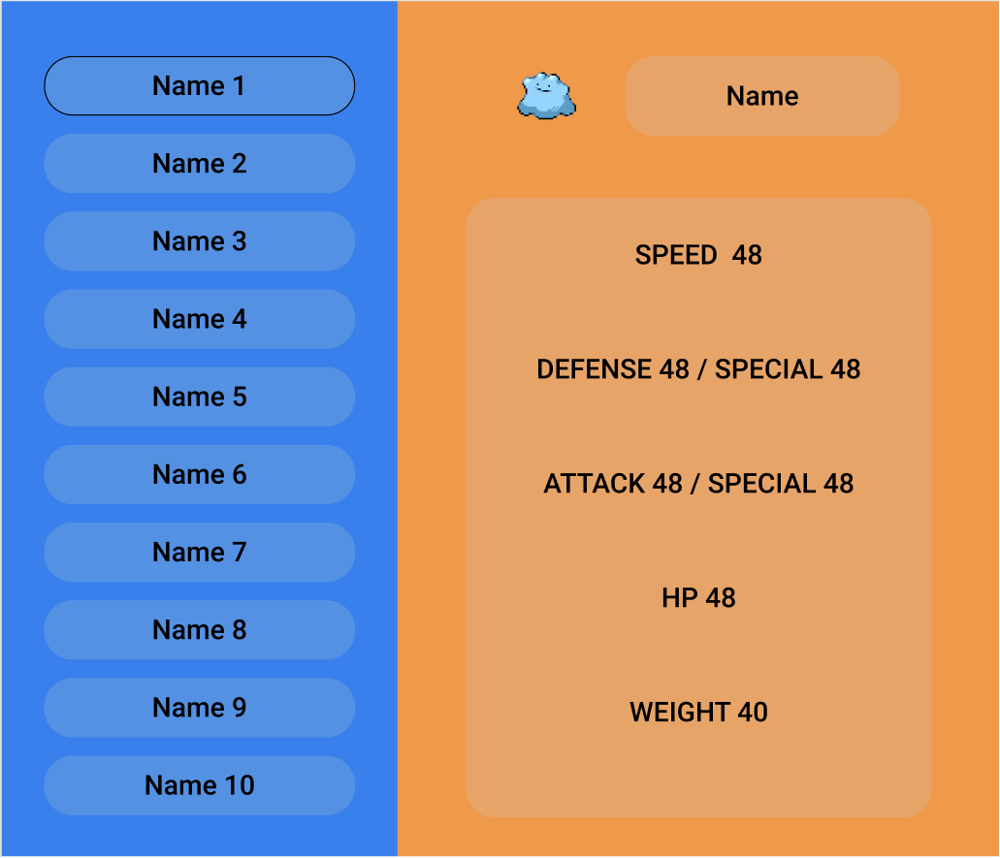

# Front-End Developmet Task: Pokemon API
This is a front-end development assignment for ECS. Before attempting this assignment, please take note of our [general instructions](../readme.md) and any additional instructions which may have been provided by the ECS recruiter. Reading the instructions carefully is part of the assignment.

Unless you have been told otherwise, please attempt both parts of the assignment. 

# Tools
You may use any tools or IDE (including online IDEs). 

Regarding the framework, you can choose between:

  * Vanilla JS
  * Typescript
  * React
  * React + Typescript

If you chose any other framework we may not be able to assess your submission.

## Wireframe

This image shows a rough wireframe diagram for how the interface should look after both parts of this assignment have been implemented. The orange section (right), is part 1. The blue section (left) is implemented in part two. 

## User Story
Pokemon Centres in the Jhoto region are considering migrating all of their internal systems to a web-based interface. You have been asked to implement a small demo that shows how a web-application can connect with an existing API. 

You must implement this user story:
  * As a user, I want to visit a web page, which shows the details of a randomly chosen pokemon.
  * When I click the Pokemon's icon, a new randomly chosen Pokemon is displayed.
  * When a new pokemon is displayed, all of the details (including the icon) will be updated.

It is widely believed that the Jhoto region is home to 151 species of Pokemon, all of which can be retrieved from the The [Pokemon API](https://pokeapi.co/).

For example:
 * [Bulbasaur #1](https://pokeapi.co/api/v2/pokemon/1)
 * [Mew #151](https://pokeapi.co/api/v2/pokemon/151)
 
All 151 Pokemon species in the Jhoto region are identified by an integer ID with a minimum value of 1 and a maximum of 151. It is rumored that higher-numbered Pokemon exist in other regions but these are outside the scope of this assignment.

## Part 1

* Display:
  * the name (for example Pikachu)
  * the number (for example, Pikachu #25)
  * the image (or icon or sprite); in the api this is the ```front-default sprite```. This icon will also be a button which causes a new randomly chosen Pokemon to be displayed.
  * the stats of a pokemon
    * speed
    * defense
    * special defense
    * attack
    * special attack
    * HP
    * Weight
    
* Create a simple interface based on the right-hand section of wireframe provided (the orange area) or your own concept.
* The image/icon of the pokemon is clickable.

## Example

1. The first time the page loads, the user can see the details of a randomly selected pokemon.
2. The user clicks on the button.
3. The section is replaced with details about a single randomly chosen Pokemon, the image of the button is replaced with the sprite of the new pokemon.

---
## Part 2

  * Create a sidebar on the left side of the screen with a list of 10 random Pokemon.
    * Each name is clickable
  * Create a main section, on the right of the sidebar
    * The main section is what you previously created in Part 1. It contains the icon-button and the details of the pokemon.
  * When I refresh the page
    * the most recently displayed pokemon should be displayed again
    * but the sidebar should list a complete new list of 10 random pokemon

# Follow up questions
1. Force click the generate button and see how the app behaves.
2. Refresh the page and see if the details of the pokemon are saved and redisplayed or not.
3. What can be improved if given more time.
4. Any ideas to take advantage of what have been done so far and build something bigger/better/awesomer.
